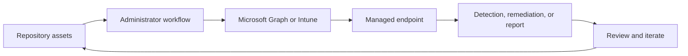

<!-- unified-readme:start -->
<div align="center">

# Intune Agent with Azure AI Foundry

**An AI-powered agent for querying and managing Microsoft Intune via natural language using Azure AI Foundry.**

Observe. Automate. Report.

[](https://github.com/JayRHa/IntuneAgent/stargazers)
[](https://github.com/JayRHa/IntuneAgent/network/members)
[](https://github.com/JayRHa/IntuneAgent/issues)
[](https://github.com/JayRHa/IntuneAgent/graphs/contributors)

---

`Endpoint Management` | `Python` | `Public` | `Maintained`

</div>

## What is this?

Intune Agent with Azure AI Foundry supports Microsoft Intune and endpoint management workflows such as automation, troubleshooting, remediation, deployment, or reporting.

## Project Context

- Use it when Intune work should be scripted, packaged, synchronized, or made easier to repeat.
- Most workflows start from repository assets, then move through Microsoft Graph, Intune, or device-side execution.
- This repository is maintained as a practical project and reference asset.

## How It Works

The repository stores scripts or tooling, administrators configure or run them, Intune and Microsoft Graph apply the work, and endpoint results feed back into reports or follow-up actions.



## Quick Start

1. Review the project context and workflow below.
2. Clone the repository:

   ```bash
   git clone https://github.com/JayRHa/IntuneAgent.git
   ```

3. Continue with the setup, usage, or workflow sections below.

---
<!-- unified-readme:end -->

## Two Implementation Approaches

This project provides two implementation approaches:

| Approach | File | Description |
|----------|------|-------------|
| **Direct OpenAI SDK** | `main.py` | Uses Azure OpenAI SDK directly with manual tool definitions |
| **Microsoft Agent Framework** | `main_agent_framework.py` | Uses the new unified Agent Framework (successor to Semantic Kernel + AutoGen) |

### Microsoft Agent Framework Benefits
- Built-in `@ai_function` decorator for cleaner tool definitions
- Native support for approval workflows on destructive actions
- Graph-based workflows for multi-agent orchestration
- Built-in OpenTelemetry integration for observability
- Middleware support for intercepting agent actions

## Prerequisites

- Azure subscription with an active Intune license
- Azure AI Foundry resource with a deployed model (GPT-4o or GPT-4)
- An app registration in Entra ID with Graph API permissions
- Python 3.10+ (3.10+ required for Microsoft Agent Framework)

## Required Graph API Permissions

Your app registration needs these Microsoft Graph API permissions (Application permissions). The `setup.sh` script configures these automatically:

- `DeviceManagementManagedDevices.Read.All`
- `DeviceManagementManagedDevices.ReadWrite.All`
- `DeviceManagementManagedDevices.PrivilegedOperations.All`
- `DeviceManagementConfiguration.Read.All`
- `DeviceManagementConfiguration.ReadWrite.All`
- `DeviceManagementApps.Read.All`
- `DeviceManagementApps.ReadWrite.All`
- `DeviceManagementRBAC.Read.All`
- `DeviceManagementServiceConfig.Read.All`

## Setup

1. Clone the repository

2. Create a virtual environment:
   ```bash
   python -m venv venv
   source venv/bin/activate  # On Windows: venv\Scripts\activate
   ```

3. Install dependencies:
   ```bash
   pip install -r requirements.txt
   ```

4. Copy `.env.example` to `.env` and configure:
   ```bash
   cp .env.example .env
   ```

5. Edit `.env` with your settings:
   - `AZURE_OPENAI_API_KEY`: Your Azure OpenAI API key
   - `AZURE_OPENAI_ENDPOINT`: Your Azure OpenAI endpoint URL
   - `MODEL_DEPLOYMENT_NAME`: The deployed model name (e.g., `gpt-4o`)
   - `AZURE_TENANT_ID`: Your Entra ID tenant ID
   - `AZURE_CLIENT_ID`: Your app registration client ID
   - `AZURE_CLIENT_SECRET`: Your app registration client secret

## Usage

### Option 1: Direct OpenAI SDK (Classic)
```bash
python main.py
```

### Option 2: Microsoft Agent Framework (Recommended)
```bash
python main_agent_framework.py
```

### Example Queries

- "Show me all non-compliant devices"
- "Which Windows devices haven't synced in 48 hours?"
- "Break down our fleet by OS"
- "Find devices without disk encryption"
- "How many devices do we have?"
- "Show me all compliance policies"

## Available Tools

| Tool | Description |
|------|-------------|
| `get_device_count` | Get total count of managed devices |
| `get_noncompliant_devices` | List all non-compliant devices |
| `get_devices_by_os` | Filter devices by operating system |
| `get_stale_devices` | Find devices that haven't synced recently |
| `get_device_breakdown_by_os` | Get device counts grouped by OS |
| `get_compliance_policies` | List all compliance policies |
| `sync_device` | Trigger a device sync |
| `get_devices_without_encryption` | Find unencrypted devices |

## Project Structure

```
intune-agent-foundry/
├── main.py                    # Classic agent (direct OpenAI SDK)
├── main_agent_framework.py    # Agent using Microsoft Agent Framework
├── graph_helper.py            # Microsoft Graph API client
├── intune_tools.py            # Function tools (classic approach)
├── requirements.txt           # Python dependencies
├── setup.sh                   # Azure app registration setup script
├── .env.example               # Environment variable template
└── README.md
```

## Learn More

- [Microsoft Agent Framework Overview](https://learn.microsoft.com/en-us/agent-framework/overview/agent-framework-overview)
- [Agent Framework GitHub Repository](https://github.com/microsoft/agent-framework)
- [Microsoft Graph API for Intune](https://learn.microsoft.com/en-us/graph/api/resources/intune-graph-overview)
